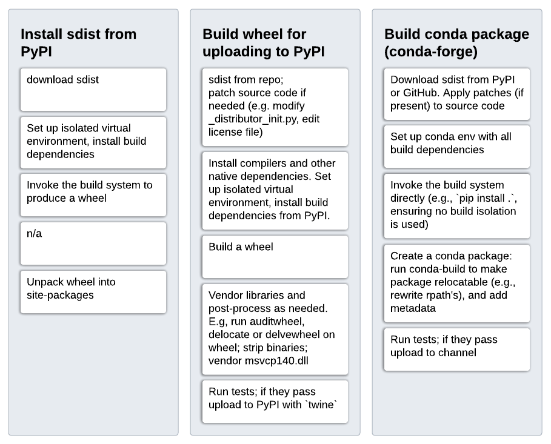

# Build & package management concepts and terminology

Having a clear picture of how build systems, package and environment managers
interact and using terminology that is well-defined is important when
discussing any concrete issue around using native code/dependencies. This
section attempts to provide such a picture.

*We'll start with build & packaging concepts and design; if terminology is
unclear, please refer to the [terminology section](#terminology) further down.*


## Package/dependency management & build systems

When using a dependency in a package at build time, we need it installed first.
Installing and using are well separated: the former is done by the package
manager, the latter by the build system.

Package managers need metadata - typically as a separate metadata file in a
specific format, including applicable version constraints - to be able to
manage dependencies. This is done in similar ways across package managers.
As an example, this is what that looks like for a package depending on
`pybind11` version 2.4.3 or later:

=== "PyPI/pip"

    For PyPI we have a `pyproject.toml` file:
    ```toml
    [build-system]
    requires = ["pybind11>=2.4.3"]
    ```

=== "Conda"

    For Conda we have a `meta.yaml` file:
    ```yaml
    requirements:
      build:
        - pybind11 >=2.4.3
    ```

=== "Spack"

    For Spack we have a `package.py` file:
    ```python
    from spack.package import *

    class PyMypkg(PythonPackage):
        depends_on("py-pybind11@2.4.3:", when="@1.9.1:", type=("build", "link"))
    ```

=== "Homebrew"

    For Homebrew we have a `pkgname.rb` file:
    ```ruby
    class Pkgname < Formula
      depends_on "pybind11"
    ```
    *Note: no `>=2.4.3` version constraint, because Homebrew provides only a
    single version per package.*

=== "Nix"

    For Nix we have a `default.nix` file:
    ```nix
    { lib
    , pybind11
    }:

    buildPythonPackage rec {
      buildInputs = [pybind11];
    ```
    *Note: no `>=2.4.3` version constraint, because Nix provides only a
    single version per package.*

At build time, the package manager is used to ensure that a dependency is
installed before the build system is invoked. Inside the config files for the
build system, the dependency can then be used:

=== "setuptools"

    For setuptools we use a `setup.py` file with:
    ```python
    import pybind11

    incdir_pybind11 = pybind11.get_include()
    ext_modules = [
        Extension('_uses_pybind',
            ['src/main.cpp'],
            include_dirs=[incdir_pybind11],
        )
    ]
    ```

=== "Meson"

    For Meson we use a `meson.build` file with:
    ```meson
    incdir_pybind11 = run_command(py,
        ['-c', 'import pybind11; print(pybind11.get_include())'],
        check: true,
    ).stdout().strip()
    inc_pybind11 = include_directories(incdir_pybind11)

    py.extension_module('_uses_pybind',
      ['src/main.cpp'],
      include_directories: [inc_pybind11],
    )
    ```

    Note: the above should be replaced by this once `pybind11` support is built-in:
    ```meson
    dep_pybind11 = dependency('pybind11')
    py.extension_module('_uses_pybind',
        ['src/main.cpp'],
        dependencies: [dep_pybind11]
    )
    ```

=== "CMake"

    For CMake used through scikit-build we use a `CMakeLists.txt` file with:
    ```cmake
    find_package(pybind11 CONFIG REQUIRED)

    pybind11_add_module(_core MODULE src/main.cpp)
    ```

!!! important

    There are quite a few build systems and even more different package
    managers. These can be mixed and matched[^1] [^2] - each build system can be
    used in any package manager.

[^1]:
    All-in-one systems like Bazel, Buck and Pants are the exception. Those are
    primarily used inside large companies where a single way of working is
    enforced, either through a monorepo or other tooling and ways of working.
    The build system parts of such systems can still be integrated with other
    package managers (e.g., TensorFlow is built with Bazel and distributed as
    wheels and conda packages) - but that is typically challenging. We won't
    consider that further here.

[^2]:
    This is not true for the packages/libraries themselves though, which in the
    vast majority of cases have only a single build system. Exceptions include: TODO SCIPY PYTORCH


### Types of package managers

The word "package manager" is applied to a wide variety of tools. It is helpful
to distinguish two different types of package managers.

(A) *System package managers*:

- Single version of each package (so may not need a solver for dependency resolution)
- All libraries needed for a functioning system (sometimes modulo `libc`)
- Multi-language
- Single-platform (often, not always)
- *Examples: Linux package managers (APT, RPM, Pacman, YUM, etc.), Homebrew,
  Nix, Guix*

(B) *Dependency package managers*:

- Multiple versions of each package at the same time (key ingredient: dependency resolution)
- Single language (often, not always)
- Multi-platform
- *Examples: Pip, Poetry, NPM, Cargo, Conan, vcpkg, Pkg (Julia), RubyGems, NuGet*

Additionally we have (C) *Environment managers*:

- Allow using different sets of packages - possibly including compilers,
  language runtime, and package manager.
- *Examples: venv, virtualenv, pyenv, nvm, RVM, nix-shell*

!!! important

    A key point to understand is that dependency package managers rely on a
    system package manager to provide packages that are not present in the
    dependency package manager's repository. See
    [native dependencies](../key-issues/native-dependencies/index.md).

This classification isn't perfect. Some tools given as above touch more or less
of another category they're in. Or they span multiple of the three categories
and some don't quite fit. A few of the most prominent examples:

- Conda spans all three categories: it relies on `libc` from the OS, but
  includes all other "system" packages, supports multiple versions for all
  packages, and supports environments.
- Spack is quite similar to Conda, at least in this classification. The main
  differences are that (a) it defaults to building from source on the user
  system (with a binary cache system), and (b) it treats compilers differently;
  they can come from the system, but Spack does know about them and allows
  using multiple compilers in a controlled fashion.
- Chocolatey provides some system-like packages like compilers (Clang, Mingw),
  Microsoft Visual C++ Redistributable's and Python interpreters - but its
  packages are mostly self-contained and it only handles a few dependencies
  in a minimal fashion.

??? question "What about PDM, Hatch, Pipenv, Nox, Tox & co.?"

    These are all more developer tools - they provide a UX for environment and
    dependency management, but rely on Pip, venv/virtualenv for dependency
    resolution and environment creation and (de)activation. Alternatively, one
    could say that they *are* dependency plus environment managers. The
    characteristics of their behavior will still be determined by the tools
    they wrap though, so for the purposes of discussing Python packaging design
    as it relates to dealing with native code it's not too useful to consider
    them separately.


## Building and installing or uploading artifacts

Now that we have all the needed concepts for "building a package", let's look
at how that works at a conceptual level. An artifact is an output of building a
package - this can be an sdist, a wheel, or a binary in a different format.
When a build gets triggered, either by a user or by an application or automated
system, these are the phases of the process that follows:


<figcaption>
Steps taken by a build or install tool to produce a build artifact
for a Python package and install or upload it.
</figcaption>

Those phases are more or less the same, independent of which package manager is
used or whether we're building for the local system or for redistribution.

!!! note ""

    Note that the build frontend and build backend may be involved in one or
    more places. Their role is to trigger the package manager and build system,
    and handle the metadata of the package appropriately and communicate it to
    the package manager and build system.

The details of every step above may be different. Here this is worked out for
three concrete cases: (a) installing an sdist from PyPI, (b) building a wheel
for redistribution on PyPI, and (c) building a conda package for redistribution
on conda-forge:


<figcaption>
Examples of concrete steps taken for three scenarios: installing an
sdist from PyPI, building a wheel to distribute on PyPI, and building a conda
package to distribute on conda-forge.
</figcaption>


## Terminology

**Build system** - the tool responsible for "building" a package. Note that
there can be multiple interpretations of what that actually means. Here we take
the operational definition that it is the tool for which you write your build
configuration files. So:

- `setup.py` -> setuptools
- `CMakelists.txt` -> CMake
- `meson.build` -> Meson
- `Makefile` -> make
- `SConstruct` -> SCons

This definition is probably the most commonly used one across technologies and
language ecosystems, and can be applied irrespective of whether or not a
package contains native code[^3] , or whether or not the build system invokes a
compiler directly or via a backend (e.g. CMake and Meson may use Ninja for
that).

[^3]:
    Note that in very simple pure Python cases, the "build configuration" may
    be no more than static metadata that is all contained in
    `[tool.build-system-name]` table in `pyproject.toml`.

**Build frontend** - the tool that is invoked by a user or by another tool to
build a wheel or sdist (e.g., [pip](https://pip.pypa.io) or
[pypa/build](https://pypa-build.readthedocs.io)). See
[PEP 517](https://peps.python.org/pep-0517/) for a more detailed description.

**Build backend** - the tool that is invoked, via the `build-backend` hook in
`pyproject.toml`, by a build frontend and is responsible for returning a wheel
or sdist to that frontend (e.g.,
[setuptools](https://setuptools.pypa.io),
[Flit](https://flit.pypa.io),
[meson-python](https://meson-python.readthedocs.io),
[scikit-build-core](https://github.com/scikit-build/scikit-build-core) or
[hatch](https://hatch.pypa.io/latest/build/)).
The build backend may be part of a build system, or it may be a fairly thin
layer in between the build frontend and the actual build system. 

**Installer** - a tool that accepts a set of package requirements, and installs
these packages on the user's system. Note that "installer" is named
"integration frontend" in PEP 517. The latter term does not seem to be commonly
used.


## Problems

One problem here is social. The Python packaging community tends to think in
terms of PyPI, wheels and sdists almost exclusively. With a lot of focus on
build frontends and build backends. For the process of building a binary, a
wheel is not that different from an RPM, Debian or Conda package. Those often
go through a wheel as an intermediate step, and use tools like `pip`. Packaging
terminology and tool design should make room for this - wheels are not that
special, they're a zip file containing a built package plus its metadata. The
most important thing about wheels are the specifications around how the
binaries inside them should be built and on what systems they are expected to
work. In terms of the build process itself, what the build system does is by
far the most time-consuming and complex part of producing a binary. A build
frontend only has set up a clean build environment[^4] and to invoke a backend,
passing along CLI options if given. A build backend is a thin layer, whose main
purpose is to invoke the build system, and then add the relevant metadata to
the final wheel.

[^4]:

    Often a build frontend does *not* have to set up a build environment. By
    default `pip` and `pypa/build` do set one up, but disabling build isolation
    with `--no-build-isolation` or `--no-isolation` is quite important, both
    for local development and for building artifacts other than wheels for
    redistribution. Whether or not to default to build isolation was a long
    debate, and there are pros and cons either way.

There are lots of practical issues not discussed on this page (e.g., wheel tags
are poorly documented and are a constant source of bugs and maintenance
effort), however those can be dealt with one by one. That is outside the scope
of this "meta topic".


## History

TODO


## Relevant resources

TODO


## Potential solutions or mitigations

- Better documentation and more education around how build & packaging works.
- ... ?
